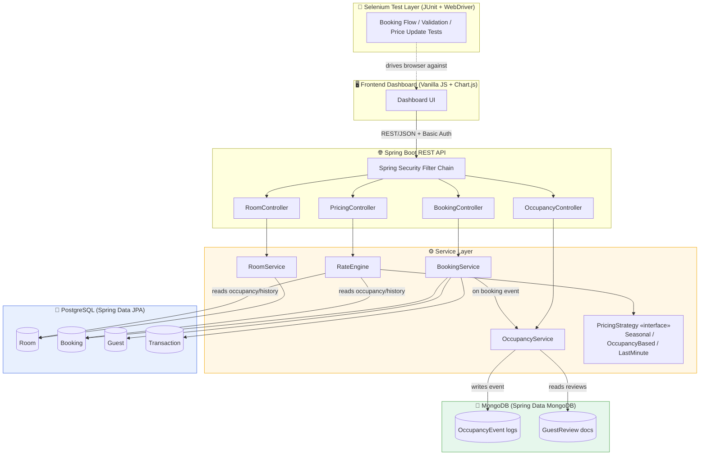
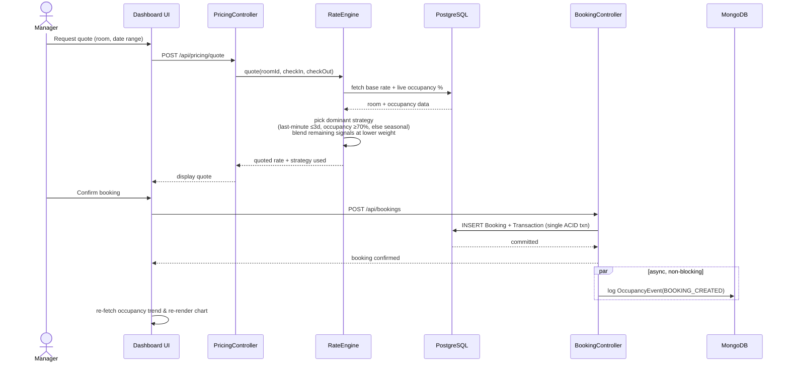
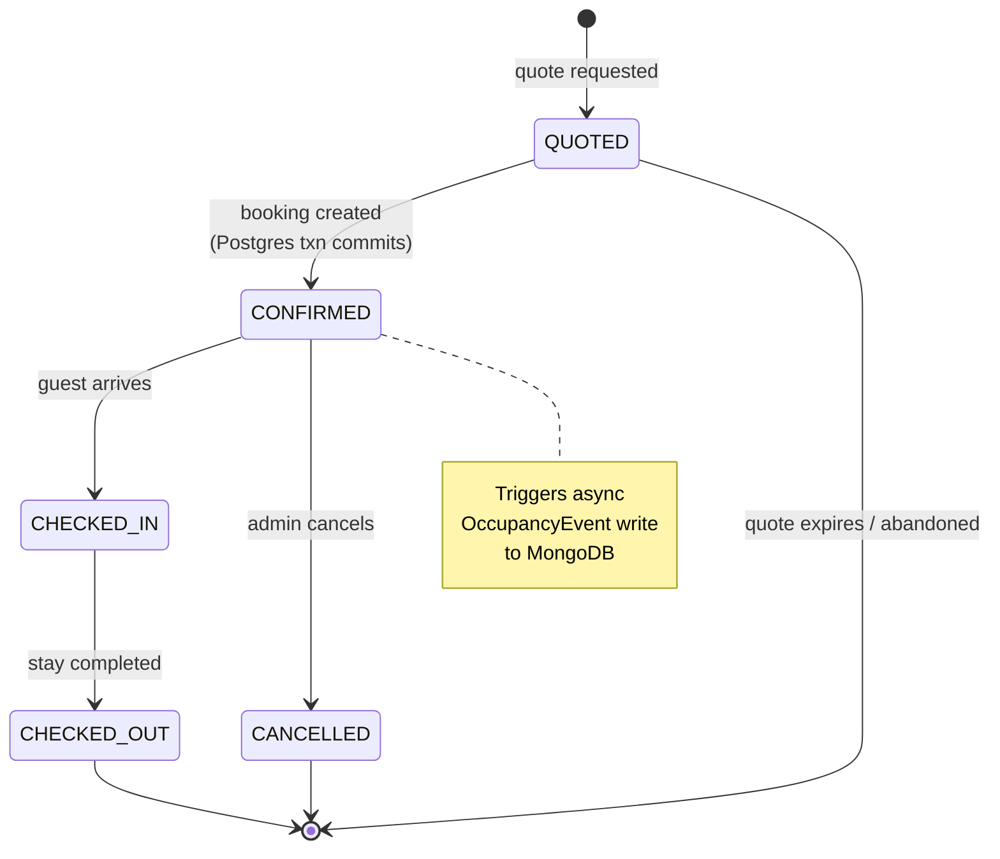
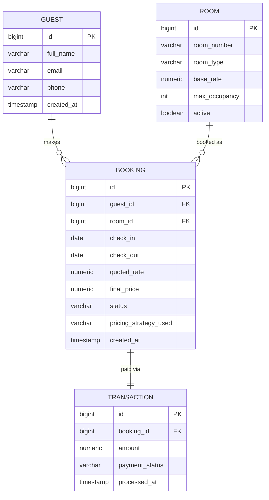
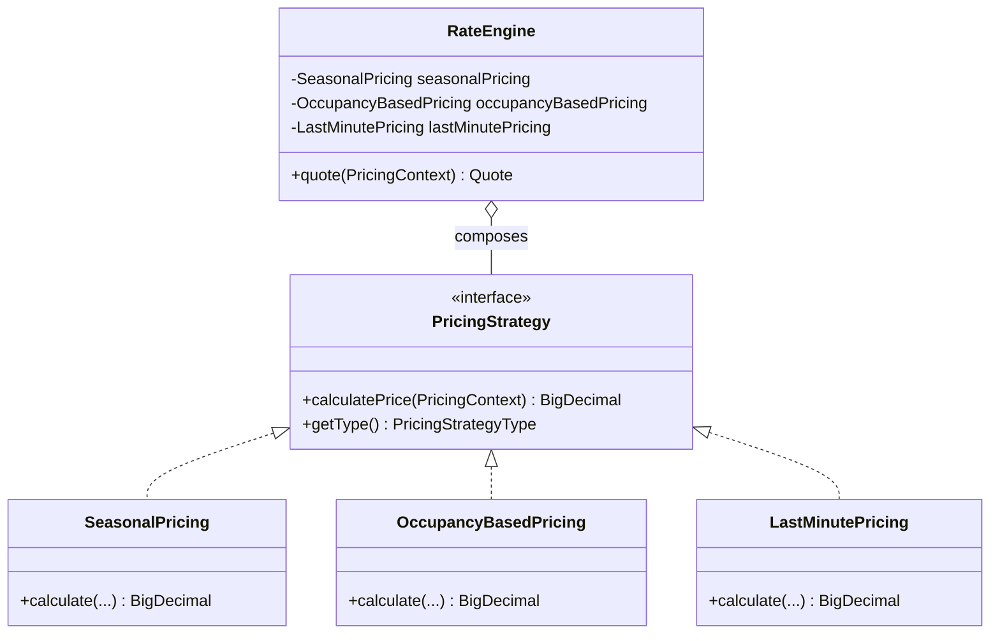

<div align="center">

# 🏨 DynamicStay
### Hotel Revenue & Booking Management System

*A portfolio project simulating the dynamic-pricing logic used by real hotel revenue management platforms (e.g. IDeaS)*


</div>

> Built as a portfolio piece for campus placement / internship interviews — optimized for **one fully-working vertical slice** (search → quote → book → see it priced correctly) rather than broad, shallow feature coverage.

---

## 📑 Table of Contents

1. [Project Overview](#1-project-overview)
2. [Architecture](#2-architecture)
3. [Tech Stack](#3-tech-stack)
4. [Security & Configuration](#4-security--configuration)
5. [Architecture Decision Records (ADRs)](#5-architecture-decision-records-adrs)
6. [Repository Structure](#6-repository-structure)
7. [Setup & Run Instructions](#7-setup--run-instructions)
8. [API Reference](#8-api-reference-summary)
9. [Notes & Known Limitations](#9-notes--known-limitations)

---

## 1. Project Overview

DynamicStay lets a **manager** view room inventory and occupancy, trigger a rate recalculation for a stay, and book a room — with the price determined at request time by one of three pluggable pricing strategies (seasonal, occupancy-based, last-minute), blended by a central `RateEngine`.

### ✨ What it demonstrates

| Area | Demonstrated by |
|---|---|
| 🧩 OOP design | Strategy pattern, clean service/controller layering |
| 🗄️ Relational modeling | ACID transactions in PostgreSQL |
| 📄 Document modeling | Schema-flexible, append-mostly analytics in MongoDB |
| 🏗️ Architecture judgment | Hybrid SQL + NoSQL chosen for real engineering reasons, not novelty |
| ✅ Test discipline | Thoroughly unit-tested pricing logic (JUnit + Mockito) |
| 🎨 Full-stack integration | A working frontend dashboard wired to the live API |
| 🤖 QA automation | Browser testing of the critical user flow (Selenium + JUnit, Page Object Model) |

The API is protected by stateless HTTP Basic authentication. A manager can view
inventory, occupancy, quotes, and bookings; an admin also has cancellation
authority. Passwords are encoded with BCrypt at startup and are supplied through
environment variables, never stored in plaintext in the database or source.

---

## 2. Architecture

### 2.1 System components



### 2.2 Booking → pricing sequence

The most interview-relevant flow — how a quote turns into a priced, persisted booking:



**Step-by-step:**

1. Manager/guest requests a quote for Room X over a date range.
2. `PricingController.quote()` → `BookingService.quote()` → `RateEngine.quote()`.
3. `RateEngine` pulls the room's base rate, current occupancy % (live query against Postgres), and days-until-check-in.
4. It picks a **dominant strategy** — last-minute if check-in is ≤3 days out, occupancy-based if the hotel is ≥70% full, seasonal otherwise — and blends in the other signals at a lower weight rather than switching on/off abruptly.
5. On booking confirmation, `BookingService` persists the `Booking` + `Transaction` in a single Postgres transaction (ACID), then **asynchronously** logs an `OccupancyEvent` document to MongoDB for analytics.
6. The dashboard re-fetches occupancy stats and re-renders the trend chart.

### 2.3 Booking lifecycle



### 2.4 PostgreSQL ER diagram



### 2.5 MongoDB document schemas

```json
// occupancy_events
{
  "_id": "ObjectId",
  "roomId": 12,
  "eventType": "BOOKING_CREATED | CHECK_IN | CHECK_OUT | CANCELLATION",
  "occupancyRateAtEvent": 0.73,
  "date": "2026-08-21",
  "timestamp": "2026-08-21T09:12:00Z",
  "metadata": { "strategyUsed": "OCCUPANCY_BASED", "finalPrice": 142.50 }
}
```

```json
// guest_reviews
{
  "_id": "ObjectId",
  "bookingId": 88,
  "roomId": 12,
  "guestName": "A. Sharma",
  "rating": 4,
  "comment": "Great view, quick check-in.",
  "stayDate": "2026-08-10",
  "createdAt": "2026-08-15T18:30:00Z",
  "tags": ["clean", "quiet", "value"]
}
```

### 2.6 Pricing strategy class design



---

## 3. Tech Stack

| Layer | Technology | Why |
|---|---|---|
| Backend | Java 17, Spring Boot 3.3 (Web, Security, Validation, JPA, Mongo) | Industry-standard, strongly-typed, testable |
| Relational DB | PostgreSQL 16 + Flyway | ACID transactions, referential integrity for bookings/payments |
| Document DB | MongoDB 7 | Schema-flexible, append-mostly analytics/event data |
| Frontend | Vanilla JavaScript + Chart.js | Lightweight, no build step, easy to demo |
| Testing (unit) | JUnit 5 + Mockito + AssertJ | Pricing boundaries, blending, security slices, and cancellation rules |
| Testing (E2E) | Selenium 4 + JUnit 5 + WebDriverManager (Page Object Model) | Automated browser verification of the core flow |
| Infra (local/deployment) | Docker Compose, multi-stage Dockerfile | Local data stores plus a non-root production-style backend image |

---

## 4. Security & Configuration

### Authentication and authorization

Spring Security uses a small in-memory user store for this portfolio project.
The configured manager receives `ROLE_MANAGER`; the configured admin receives
`ROLE_ADMIN` and `ROLE_MANAGER`. The application is stateless and uses HTTP
Basic, so no session or bearer-token store is required. BCrypt hashes the
configured passwords when the application starts.

| Resource | Manager | Admin | Anonymous |
|---|---:|---:|---:|
| Rooms, occupancy, pricing quotes | Read | Read | 401 |
| Bookings list/create | Yes | Yes | 401 |
| Booking cancellation | 403 | Yes | 401 |
| Actuator health, Swagger/OpenAPI | Public | Public | Public |

The local dashboard sends the configured credentials only for the current browser
session. It does not log credentials or tokens. For a larger deployment, the
in-memory store can be replaced by an identity provider or a database-backed
`UserDetailsService` without changing controller contracts.

### Environment configuration

Copy `.env.example` to `.env` for local development and replace every
`replace-with-*` value. Spring reads database URLs, passwords, user names,
frontend CORS origins, and authentication credentials from environment variables.
Production must set all `DYNAMICSTAY_*`, database, and `CORS_ALLOWED_ORIGINS`
values explicitly. `CORS_ALLOWED_ORIGINS` is a comma-separated allow-list; the
application never configures `*`.

The pricing model can be tuned without code changes through the `PRICING_*`
variables in `.env.example`. Defaults preserve the tested demo thresholds and
multipliers; invalid threshold ordering fails application startup rather than
silently producing unpredictable prices.

## 5. Architecture Decision Records (ADRs)

Interviewers care less about *what* you picked and more about *what you gave up*. Each decision below is framed as a tradeoff, not a sales pitch.

### ADR-001 — Strategy pattern for pricing

| | |
|---|---|
| **Decision** | Model each pricing lever (`SeasonalPricing`, `OccupancyBasedPricing`, `LastMinutePricing`) as an interchangeable implementation of one `PricingStrategy` interface, orchestrated by `RateEngine`. |
| **Alternatives considered** | (a) A single `RateEngine` method with a branching if/else over rules; (b) a rules engine (e.g. Drools) for full configurability. |
| **Why not (a)** | Works fine at 3 strategies, but every new lever adds another branch to one already-large method, and testing one rule in isolation means mocking the whole method's context. |
| **Why not (b)** | A rules engine is the "correct" answer at real RMS scale, but it's heavy machinery — extra dependency, extra runtime, and a DSL to learn — for a project meant to demonstrate OOP fundamentals, not evaluate a rules-engine product. |
| **Tradeoff accepted** | Strategy pattern is more boilerplate than a single method for 2–3 strategies, and blending multiple strategies' outputs (rather than a clean switch) pushes some complexity back into `RateEngine.blend()`. Accepted because independent testability and Open/Closed compliance were the priorities being demonstrated. |
| **Reversibility** | Easy — new strategies are additive; swapping the pattern out entirely would touch `RateEngine` and its tests but not the controllers. |

### ADR-002 — Hybrid PostgreSQL + MongoDB

| | |
|---|---|
| **Decision** | Bookings, rooms, guests, and payments live in PostgreSQL; occupancy events and guest reviews live in MongoDB. |
| **Alternatives considered** | (a) PostgreSQL only, using `jsonb` columns for event/review data; (b) MongoDB only, with bookings/payments modeled as documents with manual consistency checks. |
| **Why not (a)** | `jsonb` can absolutely model semi-structured data, and for a project this size it would have been simpler to operate (one database, one connection pool, one backup story). Rejected specifically to *demonstrate* polyglot persistence and its access-pattern reasoning — a legitimate simplification for a smaller real system. |
| **Why not (b)** | Bookings need atomic, cross-record commits (a `Booking` and its `Transaction` must succeed or fail together) and referential integrity (a booking can't reference a nonexistent room). MongoDB multi-document transactions can do this, but it's fighting the database's strengths rather than using them. |
| **Tradeoff accepted** | Two databases means two connection pools, two migration/versioning stories, two things to run locally (mitigated here with Docker Compose), and no cross-store transactions — the async `OccupancyEvent` write is deliberately allowed to fail independently of the booking. |
| **Consistency implication** | The system is designed so MongoDB writes are **best-effort and non-blocking**: if the event log write fails, the booking has already committed and the guest experience is unaffected. This is an explicit choice to favor booking-path availability over analytics completeness. |

### ADR-003 — Dominant-strategy selection with weighted blending

| | |
|---|---|
| **Decision** | `RateEngine` picks one dominant strategy per quote (by check-in proximity / occupancy threshold) but blends in the other two strategies' outputs at lower weight, rather than an on/off switch. |
| **Alternatives considered** | (a) Pure switch — exactly one strategy applies at a time; (b) always-blend — every strategy always contributes, weighted dynamically. |
| **Why not (a)** | Produces visible price discontinuities at threshold boundaries (e.g. a room jumping in price the instant occupancy crosses 70%), which is unrealistic and a bad demo experience. |
| **Why not (b)** | More "correct" in principle, but harder to explain and unit-test — reviewers of a portfolio project need to be able to predict the expected price for a given test case, and always-blend makes the dominant signal harder to see in test assertions. |
| **Tradeoff accepted** | The dominant-strategy-plus-blend approach is a deliberate middle ground: smoother than a pure switch, more explainable than a fully dynamic weighting. |

### ADR-004 — Local HTTP Basic auth, simulated payments

| | |
|---|---|
| **Decision** | Use Spring Security HTTP Basic with two BCrypt-encoded, environment-configured in-memory users; keep `Transaction.paymentStatus` simulated as `COMPLETED`. |
| **Why** | This adds testable authentication and role authorization without introducing an external identity provider or payment gateway outside the project's core scope. |
| **Tradeoff accepted** | The local user store is not a full identity system. A real deployment would delegate identity, password rotation, account recovery, and audit policy to an identity provider. |

### ADR-005 — Environment-configured CORS

| | |
|---|---|
| **Decision** | Configure explicit browser origins through `CORS_ALLOWED_ORIGINS`, defaulting only to the two local static-server origins. |
| **Why** | Local development remains frictionless while production can use a deployment-specific allow-list. |
| **Tradeoff accepted** | A frontend deployed at a new origin requires an environment update and restart; wildcard CORS is intentionally unavailable. |

### ADR-006 — Separate production container composition

| | |
|---|---|
| **Decision** | Keep `docker-compose.yml` for local database iteration and add `docker-compose.prod.yml` with the backend image, private database network, required environment values, healthchecks, and persistent volumes. |
| **Why** | The existing local workflow stays fast, while deployment configuration is explicit and does not pretend that cloud credentials or a hosted platform exist. |
| **Tradeoff accepted** | Compose is deployment-ready infrastructure, not a complete cloud rollout, secret manager, backup policy, or TLS ingress. |

---

## 6. Repository Structure

```
dynamicstay-revenue-engine/
├── backend/                # Spring Boot API (Java 17, Maven)
│   ├── src/main/java/com/dynamicstay/
│   │   ├── model/           # JPA entities: Room, Guest, Booking, Transaction
│   │   ├── mongo/           # MongoDB documents: OccupancyEvent, GuestReview
│   │   ├── repository/      # Spring Data repositories (JPA + Mongo)
│   │   ├── pricing/         # Strategy pattern: PricingStrategy + 3 implementations
│   │   ├── service/         # RateEngine, RoomService, BookingService, OccupancyService
│   │   ├── controller/      # REST controllers
│   │   ├── dto/              # Request/response DTOs
│   │   └── exception/       # Custom exceptions + @RestControllerAdvice handler
│   ├── src/main/resources/
│   │   ├── application.yml
│   │   └── db/migration/    # Flyway: schema + seed data
│   └── src/test/java/...    # JUnit + Mockito unit tests (pricing engine)
├── frontend/                # Vanilla JS dashboard (no build step)
│   ├── index.html
│   ├── css/style.css
│   └── js/{api.js,app.js}
├── selenium-tests/          # Separate Maven module — Selenium + JUnit E2E suite
│   ├── pom.xml
│   └── src/test/java/com/dynamicstay/selenium/
│       ├── BaseTest.java
│       ├── BookingFlowTest.java
│       ├── FormValidationTest.java
│       ├── PriceUpdateTest.java
│       └── pages/            # Page Object Model
├── docker-compose.yml       # Postgres + MongoDB for local dev
├── docker-compose.prod.yml  # Backend + private production-style data network
├── backend/Dockerfile       # Multi-stage non-root runtime image
├── .env.example
└── README.md
```

---

## 7. Setup & Run Instructions

### ✅ Prerequisites

- Java 17+, Maven 3.9+
- Docker + Docker Compose (for Postgres/Mongo) — or install them natively if you prefer
- A modern browser + Chrome (for Selenium)
- Python 3 (only used to serve the static frontend — any static server works)

### Step 1 — Start the data stores

```bash
cp .env.example .env
docker compose up -d
```

This starts Postgres on `localhost:5432` and MongoDB on `localhost:27017` using the values in `.env`. Flyway will create the schema and seed sample data (12 rooms, 10 guests, ~30 bookings) automatically the first time the backend starts.

### Step 2 — Run the backend

```bash
cd backend
mvn spring-boot:run
```

The API comes up on `http://localhost:8080`. Verify with:

```bash
curl http://localhost:8080/actuator/health
curl -u manager:replace-with-a-local-manager-password http://localhost:8080/api/rooms
```

The dashboard login uses the manager credentials from `.env`. The admin
credentials are reserved for cancellation and other administrative operations.

### Step 3 — Run the frontend

The dashboard is static HTML/JS — no build step. From the `frontend/` directory, serve it with any static server, e.g.:

```bash
cd frontend
python3 -m http.server 5500
```

Open `http://localhost:5500` in your browser. It talks to the API at `http://localhost:8080/api` by default (override by setting `window.DYNAMICSTAY_API_BASE` before `api.js` loads, e.g. in `index.html`).

### Step 4 — Run backend unit tests

```bash
cd backend
mvn test
```

This runs the JUnit + Mockito suite covering all three pricing strategies,
configurable boundaries, `RateEngine` selection/blending, cancellation rules,
and the security web slice.

To run the Spring integration tests, Docker must be running because Testcontainers
starts disposable PostgreSQL and MongoDB instances:

```bash
mvn -Pintegration-test test
```

The integration suite includes full-context authentication/authorization, the
concurrent same-room booking race, PostgreSQL persistence, cancellation, MongoDB
event logging, and the PostgreSQL exclusion-constraint conflict path.

### Step 5 — Run the Selenium E2E suite

With the backend (`:8080`) and frontend (`:5500`) both running:

```bash
cd selenium-tests
mvn test
```

By default tests run headless against `http://localhost:5500`. To watch them run in a visible browser, or point at a different frontend URL:

```bash
mvn test -Ddynamicstay.headless=false -Ddynamicstay.baseUrl=http://localhost:5500
```

The suite covers:

| Test class | Covers |
|---|---|
| `BookingFlowTest` | search rates → select room → book → confirm, end-to-end |
| `FormValidationTest` | invalid date ranges and overbooking/double-booking conflicts |
| `PriceUpdateTest` | verifies a recalculated rate actually changes in the UI between a far-out and a last-minute quote |

For a production-style container run, set every required value in a deployment
environment file and use:

```bash
docker compose -f docker-compose.prod.yml up -d --build
```

The backend image is built in two stages, runs as a non-root user, uses
container-aware JVM memory settings, and exposes a readiness healthcheck. TLS
termination, secret management, backups, and platform-specific networking remain
deployment responsibilities.

---

## 8. API Reference (summary)

Interactive OpenAPI documentation is available at `http://localhost:8080/swagger-ui`
when the backend is running. Actuator health, readiness, metrics, and Prometheus
endpoints are available under `/actuator`.

GitHub Actions runs backend unit tests, Testcontainers integration tests, and the
packaged build on pushes and pull requests to `main`.
The Selenium job is available as an opt-in workflow job when repository variable
`DYNAMICSTAY_RUN_E2E` is set to `true`; it runs manager scenarios and a separate
admin cancellation scenario.

| Method | Endpoint | Auth | Description |
|--------|----------|------|-------------|
| `GET`    | `/api/rooms` | MANAGER | List active room inventory |
| `GET`    | `/api/rooms/{id}` | MANAGER | Get a single room |
| `POST`   | `/api/pricing/quote` | MANAGER | Recalculate a rate for a room + date range |
| `GET`    | `/api/bookings` | MANAGER | List the 50 most recent bookings |
| `POST`   | `/api/bookings` | MANAGER | Create a booking (runs pricing, persists, logs occupancy event) |
| `DELETE` | `/api/bookings/{id}` | ADMIN | Cancel a pending or confirmed booking |
| `GET`    | `/api/occupancy/today` | MANAGER | Today's occupancy snapshot |
| `GET`    | `/api/occupancy/trend?from=&to=` | MANAGER | Daily occupancy over a date range (feeds the dashboard chart) |

`POST /api/pricing/quote` returns the final nightly price and explanation fields
for base rate, occupancy, lead time, dominant strategy, nights, total price,
and seasonal/occupancy/last-minute adjustments. Invalid requests return `400`,
missing or bad credentials return `401`, insufficient roles return `403`, and
overlap conflicts return `409`.

---

## 9. Notes & Known Limitations

This is a scoped portfolio project, not a production system. A few deliberate simplifications:

- ⚠️ **Local in-memory authentication** — credentials and role membership are configured at startup; a real RMS would delegate lifecycle, password rotation, and audit policy to an identity provider.
- ⚠️ **Payments are simulated** — `Transaction.paymentStatus` is always `COMPLETED` rather than integrated with a real payment gateway.
- ⚠️ **Pricing model is intentionally simple/explainable** (tiered multipliers) rather than a trained demand-forecasting model, since the goal is demonstrating clean OOP design and system architecture, not ML.
- ⚠️ **HTTP Basic is a lightweight local mechanism** — use TLS and a managed identity solution before exposing it beyond a trusted network.
- ⚠️ **CORS origins are environment-configured**; a deployed frontend origin must be explicitly added to `CORS_ALLOWED_ORIGINS`.
- ⚠️ **Hosted deployment is not included** because no cloud target or production secret strategy is specified; `docker-compose.prod.yml` is deployment-ready configuration, not a hosted service.

See [Section 5](#5-architecture-decision-records-adrs) for the reasoning and tradeoffs behind each of these.