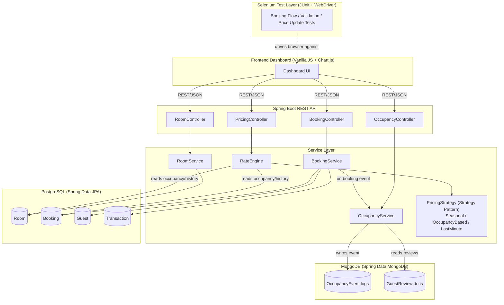
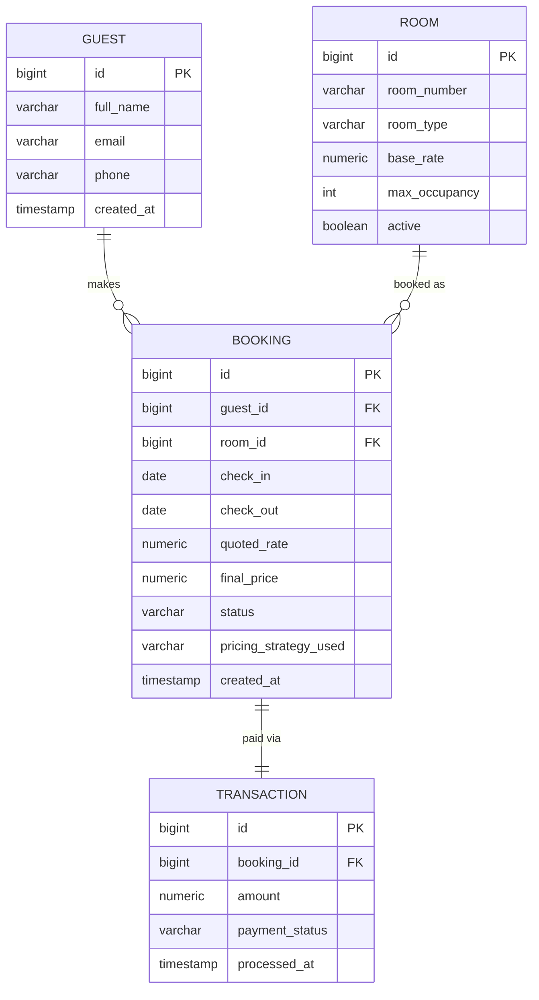

# DynamicStay — Hotel Revenue & Booking Management System

A portfolio project simulating the dynamic-pricing logic used by hotel revenue
management platforms (e.g. IDeaS): a Spring Boot REST API with a
Strategy-pattern pricing engine, a hybrid PostgreSQL + MongoDB data layer, a
lightweight JS dashboard, and a Selenium end-to-end test suite.

> Built as a portfolio piece for campus placement / internship interviews —
> optimized for one fully-working vertical slice (search → quote → book →
> see it priced correctly) rather than broad, shallow feature coverage.

---

## 1. Project Overview

DynamicStay lets a "manager" view room inventory and occupancy, trigger a
rate recalculation for a stay, and book a room — with the price determined
at request time by one of three pluggable pricing strategies (seasonal,
occupancy-based, last-minute), blended by a central `RateEngine`.

**What it demonstrates:**
- Strong OOP design (Strategy pattern, clean layering) in Java/Spring Boot
- Relational modeling + ACID transactions in PostgreSQL
- Schema-flexible, append-mostly analytics data in MongoDB
- A hybrid SQL+NoSQL architecture chosen for real engineering reasons, not novelty
- Thoroughly unit-tested pricing logic (JUnit + Mockito)
- A working frontend dashboard wired to the live API
- Automated browser testing of the critical user flow (Selenium + JUnit, Page Object Model)

---

## 2. Architecture



### Booking → pricing data flow

1. Manager/guest requests a quote for Room X over a date range.
2. `PricingController.quote()` → `BookingService.quote()` → `RateEngine.quote()`.
3. `RateEngine` pulls the room's base rate, current occupancy % (live query
   against Postgres), and days-until-check-in.
4. It picks a dominant strategy — last-minute if check-in is ≤3 days out,
   occupancy-based if the hotel is ≥70% full, seasonal otherwise — and
   blends in the other signals at a lower weight rather than switching
   on/off abruptly.
5. On booking confirmation, `BookingService` persists the `Booking` +
   `Transaction` in a single Postgres transaction (ACID), then
   asynchronously logs an `OccupancyEvent` document to MongoDB for analytics.
6. The dashboard re-fetches occupancy stats and re-renders the trend chart.

### PostgreSQL ER diagram



### MongoDB document schemas

```json
// occupancy_events
{
  "_id": "ObjectId",
  "roomId": 12,
  "eventType": "BOOKING_CREATED | CHECK_IN | CHECK_OUT | CANCELLATION",
  "occupancyRateAtEvent": 0.73,
  "date": "2026-08-21",
  "timestamp": "2026-08-21T09:12:00Z",
  "metadata": { "strategyUsed": "OCCUPANCY_BASED", "finalPrice": 142.50 }
}

// guest_reviews
{
  "_id": "ObjectId",
  "bookingId": 88,
  "roomId": 12,
  "guestName": "A. Sharma",
  "rating": 4,
  "comment": "Great view, quick check-in.",
  "stayDate": "2026-08-10",
  "createdAt": "2026-08-15T18:30:00Z",
  "tags": ["clean", "quiet", "value"]
}
```

---

## 3. Tech Stack

| Layer                 | Technology                                            | Why |
|------------------------|--------------------------------------------------------|-----|
| Backend                | Java 17, Spring Boot 3.3 (Web, Validation, JPA, Mongo) | Industry-standard, strongly-typed, testable |
| Relational DB           | PostgreSQL 16 + Flyway                                 | ACID transactions, referential integrity for bookings/payments |
| Document DB             | MongoDB 7                                               | Schema-flexible, append-mostly analytics/event data |
| Frontend                | Vanilla JavaScript + Chart.js                           | Lightweight, no build step, easy to demo |
| Testing (unit)          | JUnit 5 + Mockito + AssertJ                              | Thorough coverage of the pricing engine |
| Testing (E2E)           | Selenium 4 + JUnit 5 + WebDriverManager (Page Object Model) | Automated browser verification of the core flow |
| Infra (local)           | Docker Compose                                          | One command to stand up Postgres + Mongo |

---

